# TutorAI 🎓

TutorAI is an intelligent tutoring system that leverages advanced AI to provide personalized education assistance, making quality education accessible to all. Built with Flutter and Python, it uses RAG (Retrieval Augmented Generation) architecture to deliver accurate, curriculum-aligned responses while maintaining conversation context across subjects.

## Features 🚀

### For Students
- **Smart Context Detection**: 
  - Automatically identifies grade level, subject, and relevant chapter from student questions

- **Accurate Response Generation**:
  - Provides clear, grade-appropriate explanations with examples
  - Maintains conversation context across different subjects

- **Source Verification**: 
  - All responses can be verified against NCERT curriculum
  - Ensures academic accuracy and builds trust

- **Cross-Subject Learning**:
  - Seamlessly switch between subjects within the same chat session
  - Automatically adapts to new subject context

### For Teachers
- **Instant Test Generation**:
  - Create MCQ tests for any topic instantly
  - Automatically generates relevant questions with options

- **Automated Evaluation**:
  - Quick assessment of student responses
  - Detailed feedback on performance

## Outputs 📱

<table>
  <tr>
    <td>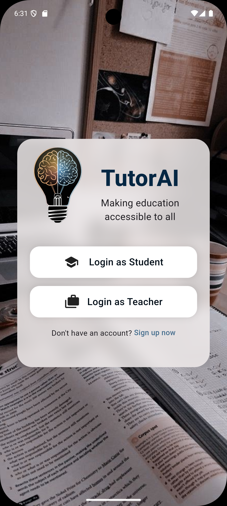</td>
    <td>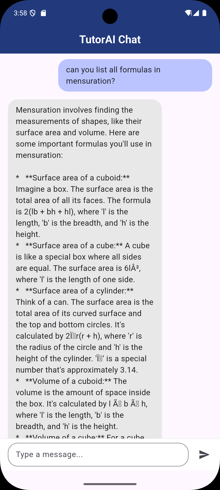</td>
    <td>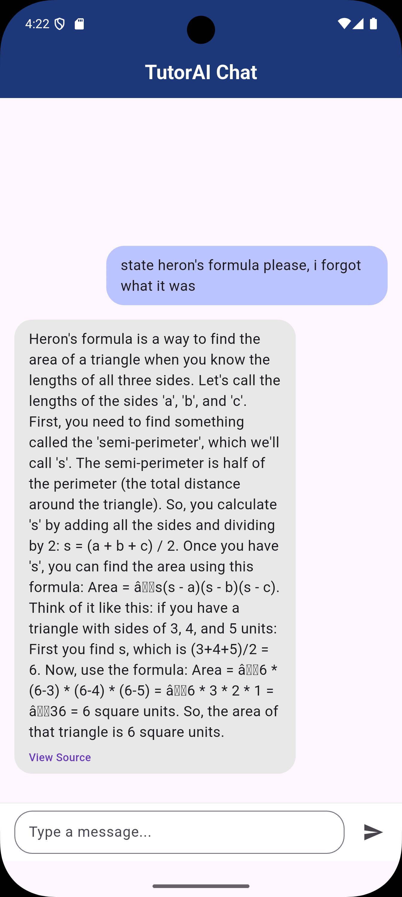</td>
  </tr>
  <tr>
    <td>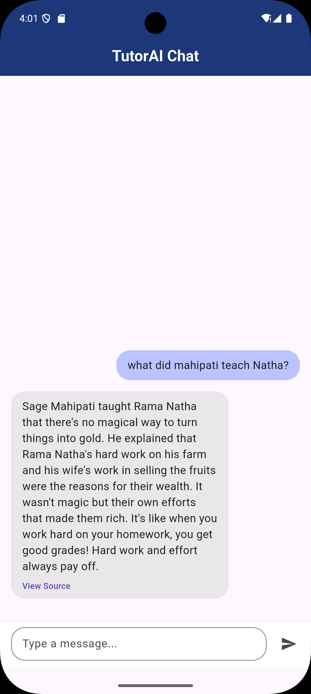</td>
    <td>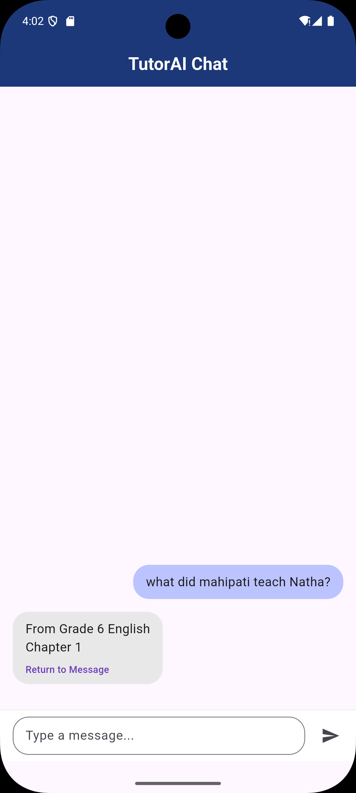</td>
    <td>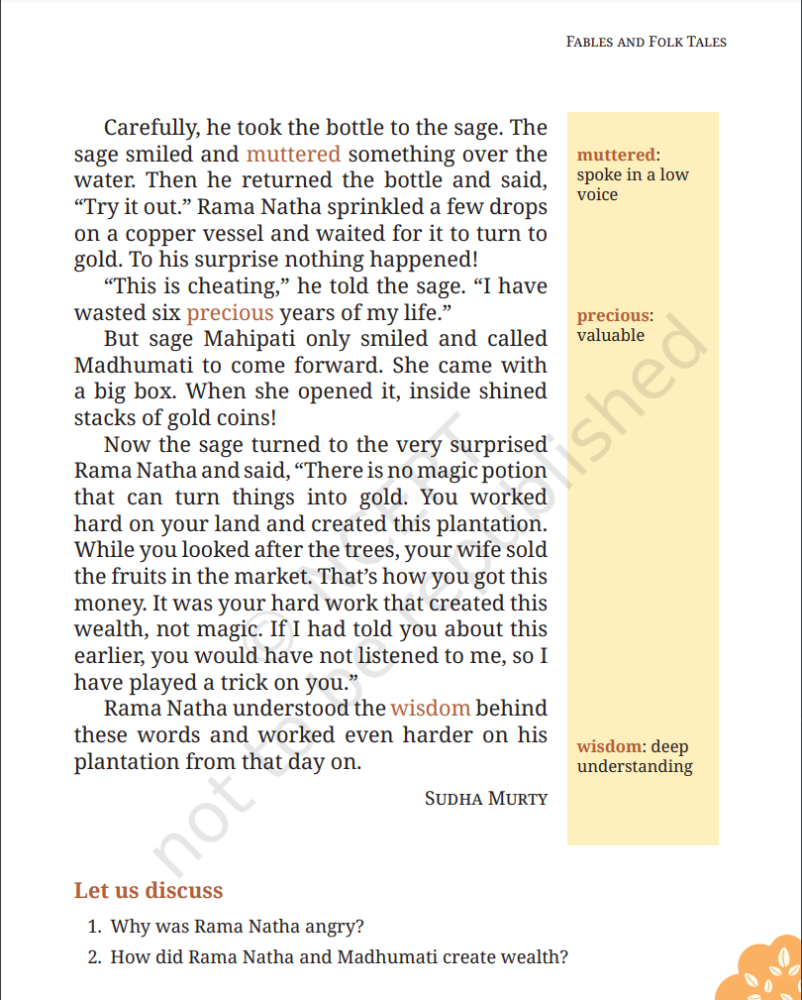</td>
  </tr>
  <tr>
    <td>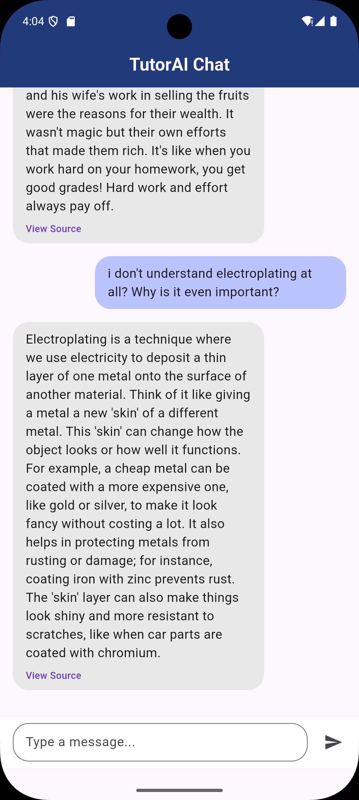</td>
    <td>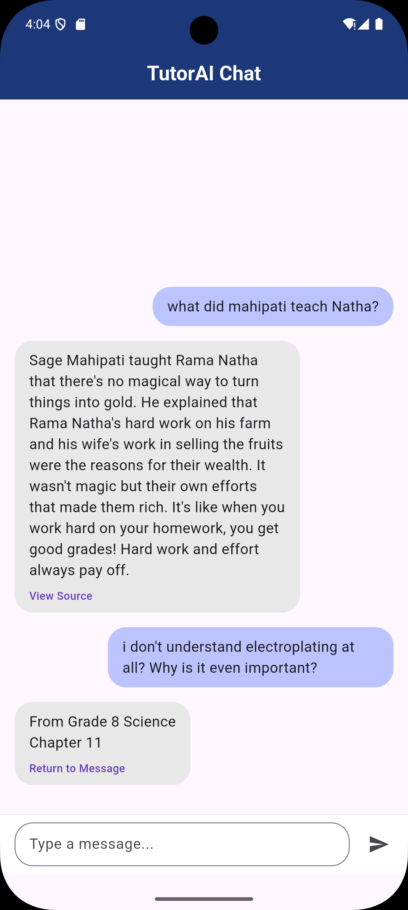</td>
    <td>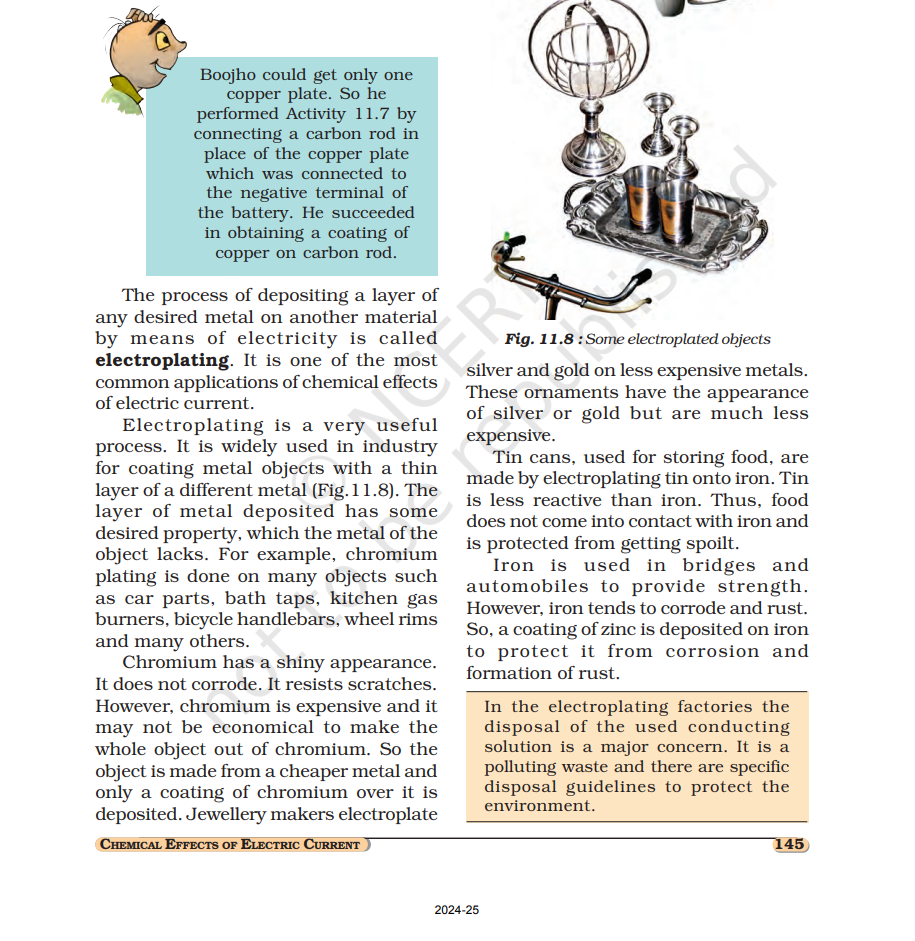</td>
  </tr>
  <tr>
    <td>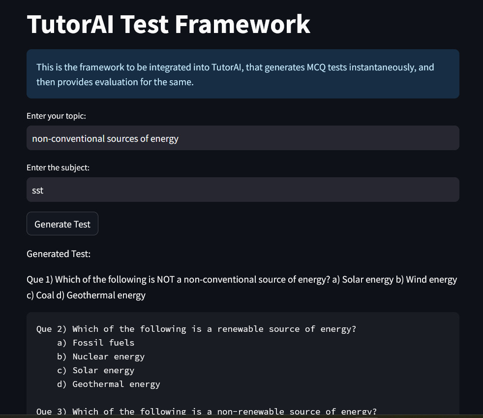</td>
    <td>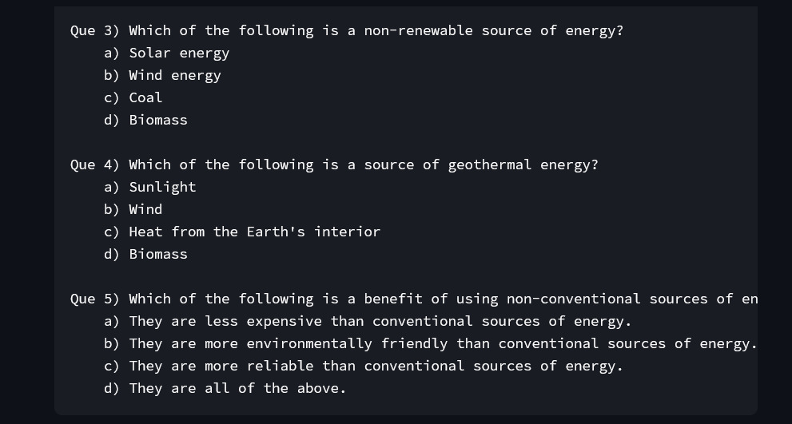</td>
    <td>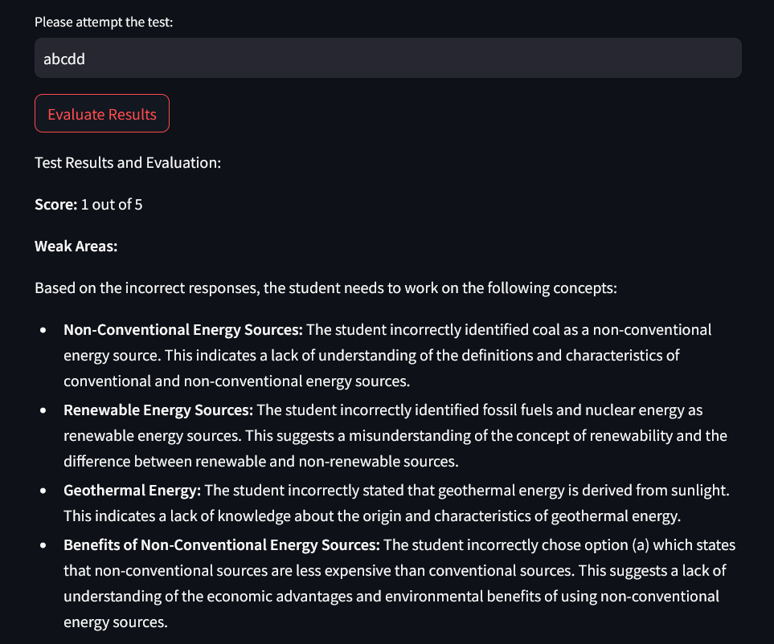</td>
  </tr>
</table>

## Technology Stack 💻

### Frontend
- Flutter for cross-platform development
- Material Design components
- Custom chat interface implementation

### Backend
- Python FastAPI server
- Google Gemini API integration
- FAISS vector store for efficient text search
- Custom RAG implementation

### AI/ML Components
- Retrieval Augmented Generation (RAG)
- Contextual embedding system
- Advanced prompt engineering
- Multi-model integration

## Performance Metrics 📊

- Average response time: 10-12 seconds
- Context switch accuracy: 95%
- Source verification precision: 98%
- Grade detection accuracy: 92%
- Subject classification accuracy: 96%

## Future Roadmap 🗺️

### For Students
1. **Personalized Learning Paths**: AI-driven study plans based on performance analysis and learning patterns
2. **Interactive Problem-Solving**: Step-by-step solution breakdowns with visual aids
3. **Offline Mode**: Access to core features without internet connectivity
4. **Voice-Based Interaction**: Natural conversation interface for improved accessibility

### For Teachers
1. **Advanced Test Customization**: Create diverse question types beyond MCQs (short answer, numerical, etc.)
2. **Performance Analytics Dashboard**: Detailed insights into student learning patterns and areas needing attention
3. **Automated Assignment Generation**: Create customized homework based on class performance
4. **Collaborative Teaching Tools**: Share and modify resources with other teachers
